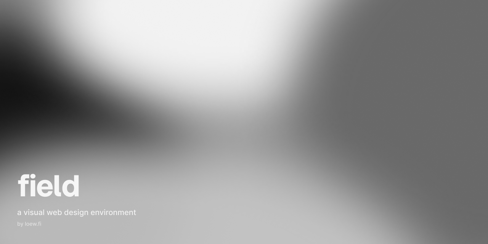

# field

**A visual web design environment by [loew.fi](https://loew.fi).**

*The design is the real website.*

field is a place to shape a website visually while keeping its source and running result in view. Design a page on the canvas, maintain its content, work directly with code, and check the result in Preview. The aim is for those views of a project to describe the same website.

The editor is in active development. This repository contains the application, its isolated canvas and preview runtimes, and the work of bringing familiar design-tool interactions to a live web project.

## Four ways into the same project

| Surface | What it is for |
| --- | --- |
| **Design** | Compose pages visually: layout, typography, styling, components, assets, and interactions. |
| **Content** | Maintain copy, structured content, metadata, and localization. |
| **Code** | Inspect and edit the project source directly. Source is part of the project, not a one-time export. |
| **Preview** | See the website running. When the editor and runtime disagree, Preview is the reference for what the site actually does. |

field is built from a customized Revyme foundation. Some `Revyme` names remain in dependencies, protocols, and storage because they are compatibility boundaries; they do not change the product name.

## Run it locally

You need **Node.js 22 or newer** and npm.

```bash
npm ci
npm run dev
```

Open the editor at **[localhost:3333](http://localhost:3333)**. The development command also starts the Canvas runtime on port **5174** and Preview on port **5175**; keep all three running together. By default, the standalone editor stores local projects in your browser. Cloud services require separate configuration; see [`.env.example`](.env.example).

## Working in the repository

| Command | Purpose |
| --- | --- |
| `npm run dev` | Start the editor, Canvas, and Preview development servers. |
| `npm run test:run` | Run the unit tests once. |
| `npm run lint` | Check the application source with ESLint. |
| `npm run build:all` | Build all three production surfaces. |
| `npm run e2e` | Run the Playwright end-to-end suite. |

The three surfaces run separately by design:

| Surface | Local port | Source |
| --- | ---: | --- |
| Editor | 3333 | [`src/editor/`](src/editor/) |
| Canvas | 5174 | [`src/canvas/`](src/canvas/), [`src/canvas-sandbox/`](src/canvas-sandbox/) |
| Preview | 5175 | [`src/preview-sandbox/`](src/preview-sandbox/) |

Project and document logic lives primarily in [`src/code/`](src/code/); backend integration is in [`src/backend/`](src/backend/). See [CONTRIBUTING.md](CONTRIBUTING.md) for the contribution workflow and validation expectations.

## The principle

> The design is the real website.

A visual editor is most useful when its document, source, and runtime stay in agreement. field treats divergence between them as a product bug to trace and fix, rather than a difference to conceal. The project should remain inspectable and portable, and Preview should show what the website really does.

## License & attribution

field is licensed under [AGPL-3.0-only](LICENSE). It is a modified derivative of Revyme; [NOTICE](NOTICE) records the required upstream attribution and additional terms. Keep both files with redistributed copies.

**field by [loew.fi](https://loew.fi)**
